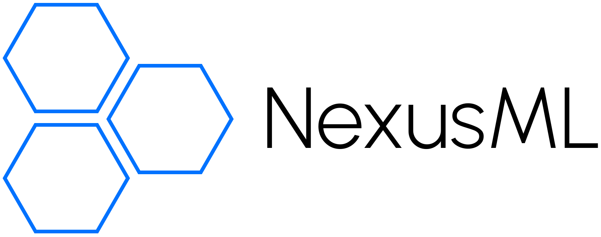

<p align="center">
  
</p>

- [Introduction](#introduction)
- [Requirements](#requirements)
- [Maintainers](#maintainers)
- [Acknowledgments](#acknowledgments)
- [Contribute](#contribute)
- [Issues and Feature Requests](#issues-and-feature-requests)

## Introduction

NexusML UI is a React-based web application designed to serve as the user interface for [NexusML](https://github.com/neuraptic/nexusml).

## Requirements

### Libraries and Tools

* [Node.js](https://nodejs.org/en)
* [Material UI](https://mui.com/material-ui/getting-started/installation/)
* [NexusML](https://github.com/neuraptic/nexusml)

### Material UI License

NexusML UI requires a valid Material UI license (Pro Plan) for certain features and usage.

To obtain a license, follow these steps:

1. Visit the [Material UI Licensing Page](https://mui.com/store/items/mui-x-pro/).
2. Follow the instructions on the licensing page to purchase and activate your license.

Once you have your license key, configure it by adding it to your project’s environment variables.

```
REACT_APP_MUI_LICENSE='Your material UI license'
```

For further assistance, please refer to the [Material UI documentation](https://mui.com/getting-started/installation/).

### Environment Variables

Here is the list of required environment variables:

> ⚠️ **Warning:** There are three environment setups (```.env.local```, ```.env.dev```, and ```.env.prod```) to ensure smooth deployment and proper configuration across different stages of development. Remember to update the package.json scripts to match your ```.env``` configuration.

```
REACT_APP_NAME='APP name'
REACT_APP_ENV='environment (development or production)'
REACT_APP_API_URL='API url'
REACT_APP_MUI_LICENSE='Your Material UI license'
```

For Auth0 (optional), you will need to set the following environment variables:

```
REACT_APP_AUTH_REDIRECT_URI='Auth0 redirect/callback URL'
REACT_APP_AUTH0_DOMAIN='Auth0 tenant domain'
REACT_APP_AUTH0_CLIENT_ID='Auth0 client ID'
REACT_APP_AUTH0_AUDIENCE='Auth0 audience'
REACT_APP_AUTH0_SCOPE='Auth0 scopes'
```

## Installation

For installation, you must follow first this set of instructions:

1. Install [Node.js](https://nodejs.org/en) in your local machine (last tested version Node 22.6.0)

2. Clone the repository.

```
git clone https://github.com/neuraptic/nexusml-ui
```

3. Install all the necessary packages by going to the root directory of the project and using the `npm install` on the command line.

> ⚠️ **Important:**
If the installation retrieves a breaking error, remove node_modules folder, package-lock.json and reinstall.

```javascript
npm install
```

> ⚠️ **Warning:** Remember to update the scripts to match your environment configuration.

Once you have all set, you can start the app:

```
npm start
npm start-dev
npm start-prod
```

or create a new build for the required environment:

```
npm run build
npm run build-dev
npm run build-prod
```

## Maintainers

NexusML UI is maintained by the following individuals (in alphabetical order):

- Miguel Perez Martinez ([@miguelperezmartinez](https://github.com/MiguelPerezMartinez))

## Acknowledgments

We would like to recognize the valuable contributions of the following individuals (in alphabetical order):

- Enrique Hernández Calabrés ([@ehcalabres](https://github.com/ehcalabres))
- Vladyslav Naumenko ([@thepureinx000](https://github.com/thepureinx000))


## Contribute

Please review the [Contributing Guidelines](CONTRIBUTING.md) before making any contributions. Ensure that your code 
and documentation comply with all the outlined instructions.

## Issues and Feature Requests

Report any issues or submit feature requests in the [Issues](https://github.com/neuraptic/nexusml-ui/issues) section 
of the official NexusML UI repository. Discussions and updates related to these will be managed there.
